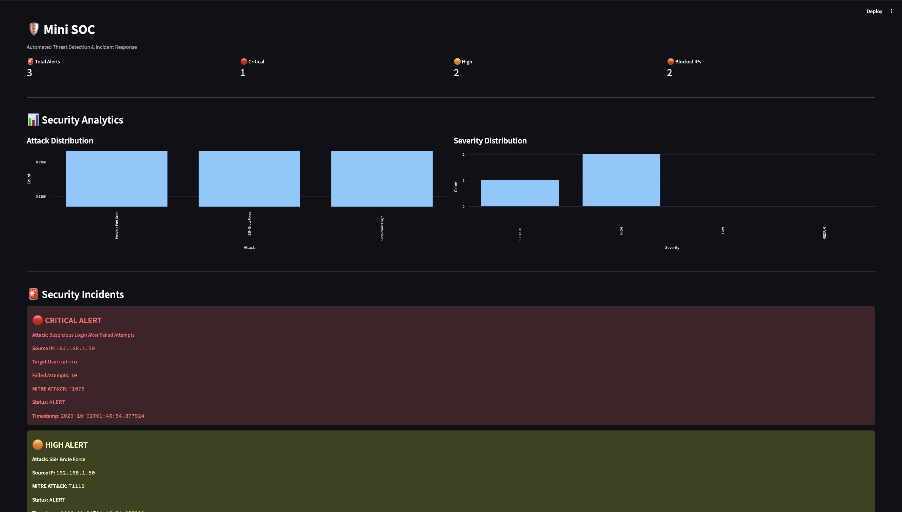
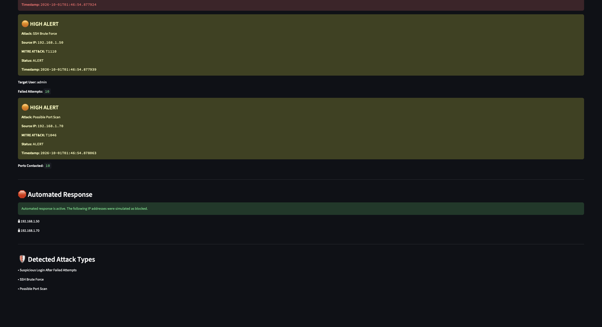
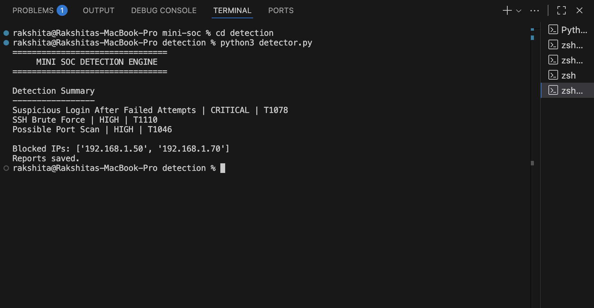

# 🛡️ Mini SOC — Automated Threat Detection & Incident Response

A lightweight Security Operations Center (SOC) simulation built with Python and Streamlit to detect suspicious security events, classify threats, map them to MITRE ATT&CK techniques, generate incident reports, and simulate automated response actions.

## 🚀 Features

- 🔍 SSH brute-force detection
- 🚨 Suspicious login detection after repeated failed attempts
- 🌐 Port-scan detection
- ⚠️ Severity classification
- 🎯 MITRE ATT&CK technique mapping
- 🛑 Simulated automated IP blocking
- 📡 Real-time log monitoring
- 📄 JSON-based incident reporting
- 📊 Interactive Streamlit dashboard
- 🧪 Controlled security-event simulation

## 🏗️ Architecture

```text
                    MINI SOC
                       │
          ┌────────────┴────────────┐
          ↓                         ↓
      auth.log                 network.log
          │                         │
          ↓                         ↓
   Real-Time Monitor        Network Detection
          │                         │
          └────────────┬────────────┘
                       ↓
                Detection Engine
                       │
              ┌────────┴────────┐
              ↓                 ↓
          Severity          MITRE ATT&CK
              │                 │
              └────────┬────────┘
                       ↓
                Incident Reports
                       │
                       ↓
              Simulated Response
                       │
                       ↓
              Streamlit Dashboard
```

## 🔎 Detected Threats

| Threat | Severity | MITRE ATT&CK |
|---|---|---|
| SSH Brute Force | HIGH | T1110 |
| Suspicious Login After Failed Attempts | CRITICAL | T1078 |
| Possible Port Scan | HIGH | T1046 |

## 📸 Screenshots

### 🛡️ Dashboard Overview



### 🚨 Security Incidents & Response



### 🔍 Detection Engine




## 📊 Dashboard

The Streamlit dashboard provides:

- Total security alerts
- Critical and high-severity alerts
- Blocked IP addresses
- Attack distribution
- Severity distribution
- Detailed security incidents
- MITRE ATT&CK mappings
- Simulated automated response

## 📁 Project Structure

```text
mini-soc/
│
├── collector/
│   ├── log_reader.py
│   ├── simulate_attack.py
│   └── monitor.py
│
├── detection/
│   └── detector.py
│
├── dashboard/
│   └── app.py
│
├── reports/
│   ├── incidents.json
│   └── blocked_ips.json
│
├── sample_logs/
│   ├── auth.log
│   └── network.log
│
├── tests/
│
├── README.md
├── requirements.txt
└── .gitignore
```

## ⚙️ Technologies Used

- Python
- Streamlit
- Pandas
- JSON
- Linux-style authentication logs
- MITRE ATT&CK framework

## ▶️ How to Run

### 1. Clone the repository

```bash
git clone <your-repository-url>
cd mini-soc
```

### 2. Install dependencies

```bash
pip install -r requirements.txt
```

### 3. Run the detection engine

```bash
cd detection
python3 detector.py
```

### 4. Start real-time monitoring

Open another terminal:

```bash
cd collector
python3 monitor.py
```

### 5. Start the dashboard

Open another terminal:

```bash
cd dashboard
python3 -m streamlit run app.py
```

## 🧪 Security Event Simulation

The project uses controlled log data to simulate security events such as:

- Repeated SSH authentication failures
- Suspicious successful login after failed attempts
- Multiple connections to different network ports

These events are processed by the detection engine and classified according to predefined detection rules.

## 🛡️ Automated Response

When a HIGH or CRITICAL event is detected, the system simulates blocking the source IP address.

Example:

```text
Attack: Suspicious Login After Failed Attempts
Severity: CRITICAL
MITRE ATT&CK: T1078
Status: ALERT

Automated Response
------------------
Blocked IP: 192.168.1.50
Response status: SIMULATED
```

> **Note:** IP blocking is simulated for educational and portfolio purposes. The project does not modify real firewall rules or block real network traffic.

## 📄 Incident Reporting

Detected incidents are stored in JSON format:

```text
reports/incidents.json
reports/blocked_ips.json
```

This allows the dashboard and other components to consume the generated security data.

## 🎯 Learning Objectives

This project was built to gain practical experience with:

- Security monitoring
- Log analysis
- Threat detection
- Incident response
- Security automation
- MITRE ATT&CK
- SOC workflows
- Python scripting
- Security dashboards

## 🔮 Future Improvements

Possible extensions include:

- Real firewall integration
- Email or Telegram alerts
- More authentication attack detections
- Malware/hash detection
- Windows event-log support
- Authentication anomaly detection
- Threat-intelligence integration
- Database-backed incident storage
- Role-based SOC dashboard

## 👩‍💻 Author

**Rakshita Durairaj**

Cybersecurity student interested in ethical hacking, network security, digital defence, and security operations.
```
